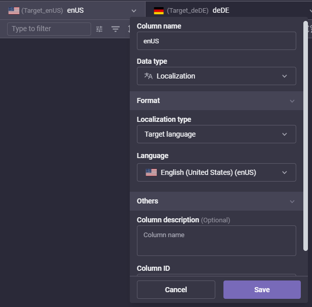
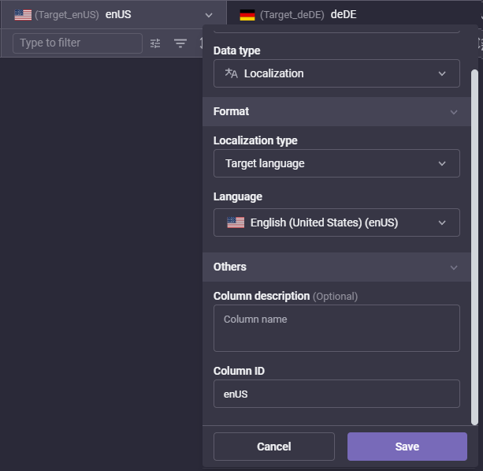

# Unity Localization Plugin for Gridly

This plugin facilitates the integration of Unity's Localization package with Gridly, enabling seamless management and translation of in-game text. Below are the steps to install, configure, and use the plugin.

## Installation

1. **Install Unity Localization Package**  
   - Download and install the Unity Localization package from the [Unity Documentation](https://docs.unity3d.com/Packages/com.unity.localization@1.0/manual/index.html).  
   - Follow the instructions to add target languages and manage strings in your application.

2. **Copy Plugin Folder**  
   - Extract the plugin folder and copy it into your `Assets` folder for example `My project\Assets\Gridly-loc-package`.

3. **Add Target Languages**  
   - Go to `Edit -> Project Settings -> Localization` and add your target languages.

4. **Add String Tables**  
   - Navigate to `Window -> Asset Management -> Localization Tables` and create your string tables.

---

## Plugin Settings

1. **Configure CSV Path**  
   - Set the path in which the plugin will generate CSV files.

2. **Set View ID**  
   - Enter your Gridly View ID.

3. **Set API Key**  
   - Provide your Gridly API key for authentication.

4. **Add Localization Tables**  
   - Ensure your localization tables are set up in Unity.

5. **Select Languages for Gridly**  
   - Choose the languages you want to send to Gridly from the Localization table.

## Notes
1. **Use separate views for push and pull**
	- If you check the option "Use different View for Import", you can define a separate View ID and Password for importing from Gridly to Unity."

2. **Smart strings**
	- You can set the string type you would like to send or receive using the plugin. In the Unity localization package, you can set strings as smart strings. Using the import/export type selection, you can define whether you want to send/receive only smart/non-smart or all types of strings.

3. **Keep your View in synch with your Unity records**
	- If desired, you can use the "Delete removed records from Gridly" setting. This results in strings being removed from Gridly if they have been removed from Unity.

---

## Sending Content to Gridly

- In Gridly, ensure that the column name and ID match the language code used in Unity (e.g., `enUS`, `frFR`, `esES`).  
<figures style="text-align: center">
<figure>
        
        <figcaption>Set column name in column properties</figcaption>
    </figure>

<figure>
        
        <figcaption>Set column ID in column properties</figcaption>
    </figure>
</figures>

- After configuring the settings, you can send your content to Gridly.

---

## Importing Translations from Gridly

1. **Open the Plugin**  
   - Ensure the plugin is open in Unity.

2. **Verify View ID and API Key**  
   - Confirm that the correct View ID and API key are configured.

3. **Fetch Data from Gridly**  
   - Click on `Get View Data from Gridly`.

4. **Select Files and Languages**  
   - Choose the file(s) and language(s) you want to import.

5. **Import Data**  
   - Click on `Import Selected Data` to pull the translations back to Unity.

---

For further assistance about the Unity Localization package, consult the [Unity Localization Documentation](https://docs.unity3d.com/Packages/com.unity.localization@1.0/manual/index.html).